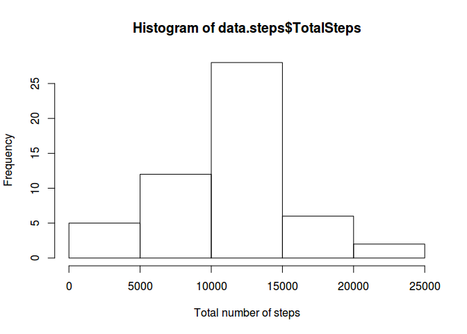
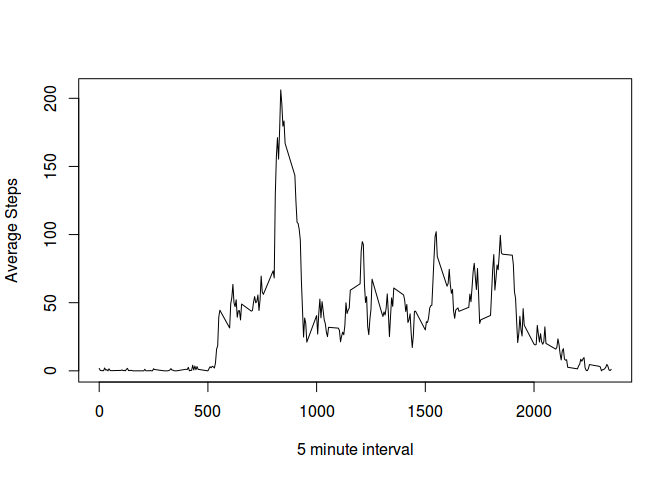
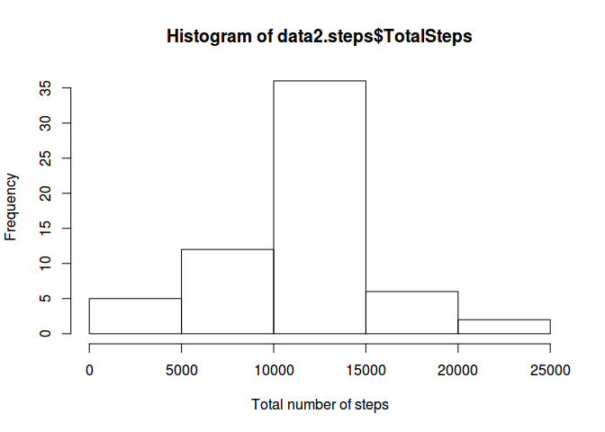
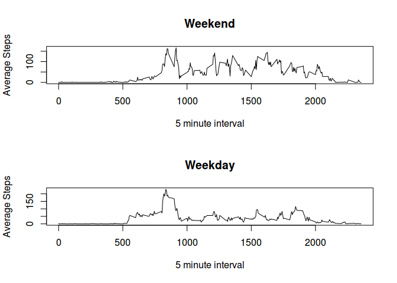

# Reproducible Research: Peer Assessment 1
## Basic settings
This settings are set make code visible and format numbers output:

```r
echo = TRUE
options(scipen = 1, digits = 2) 
```


## Loading and preprocessing the data
Load the data process and "dplyr" library

```r
library(dplyr)
```

```
## 
## Attaching package: 'dplyr'
## 
## The following object is masked from 'package:stats':
## 
##     filter
## 
## The following objects are masked from 'package:base':
## 
##     intersect, setdiff, setequal, union
```

```r
data <- read.csv("activity.csv", sep=",", header = TRUE)
```

##What is mean total number of steps taken per day?

For this part of the assignment, we calculate the total number of steps taken per day, ignoring the missing values in the dataset.

```r
data.steps <- data %>% group_by(date) %>% summarise(sum(steps))
colnames(data.steps)[2] <- "TotalSteps"
hist(data.steps$TotalSteps, xlab="Total number of steps")
```

 

The mean number of steps per day is 10766.19 and and the median number of steps per day is 10765

## What is the average daily activity pattern?

Here is a time series plot of the 5-minute interval (x-axis) and the average number of steps taken, averaged across all days (y-axis

```r
average.steps <- data %>% group_by(interval) %>% summarise(mean(steps, na.rm = T))
colnames(average.steps)[2] <- "AverageSteps"
plot(average.steps$interval, average.steps$AverageSteps, type="l", xlab = "5 minute interval", ylab="Average Steps" )
```

 

The 5-minute interval, on average across all the days in the dataset, contains the maximum number of steps is interval 835

## Imputing missing values

Note that there are a number of days/intervals where there are missing values (coded as NA). The presence of missing days may introduce bias into some calculations or summaries of the data.

The total number of missing values in the dataset is 

```r
sum(is.na(data))
```

```
## [1] 2304
```


We create a new dataset that is equal to the original dataset but with the missing data filled in with the average steps of that date
    

```r
data2 <- merge(data, average.steps, by.x="interval", by.y="interval")
data2$steps[which(is.na(data2$steps)==TRUE)] <- data2$AverageSteps[which(is.na(data2$steps)==TRUE)]
```

Then, we create a histogram of the total number of steps taken each day and Calculate and report the mean and median total number of steps taken per day. 

```r
data2.steps <- data2 %>% group_by(date) %>% summarise(sum(steps))
colnames(data2.steps)[2] <- "TotalSteps"
hist(data2.steps$TotalSteps, xlab="Total number of steps")
```

 

The mean and median of the total number of steps taken per day are 10766.19 and 10766.19 . The mean value is still the same and the median value is increades because we replaced NA values with the average steps of that date

## Are there differences in activity patterns between weekdays and weekends?

We create a new factor variable in the dataset with two levels – “weekday” and “weekend” indicating whether a given date is a weekday or weekend day. Then, we make a panel plot containing a time series plot (i.e. type = "l") of the 5-minute interval (x-axis) and the average number of steps taken, averaged across all weekday days or weekend days (y-axis).


```r
library(lubridate)
data2$WeekDay <- ifelse(wday(as.Date(data2$date))==1 | wday(as.Date(data2$date))==7, "Weekend", "Weekday")
average.steps2 <- data2 %>% group_by(interval, WeekDay) %>% summarise(mean(steps, na.rm = T))
colnames(average.steps2)[3] <- "AverageSteps"
Weekend <- subset(average.steps2, average.steps2$WeekDay=="Weekend")
Weekday <- subset(average.steps2, average.steps2$WeekDay=="Weekday")
par(mfrow=c(2,1))
plot(Weekend$interval, Weekend$AverageSteps, type="l",xlab = "5 minute interval", ylab="Average Steps", main = "Weekend")
plot(Weekday$interval, Weekday$AverageSteps, type="l",xlab = "5 minute interval", ylab="Average Steps", main = "Weekday")
```

 

